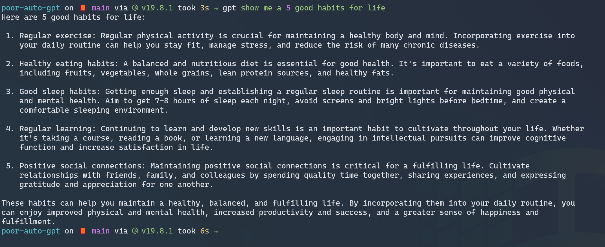

Run ChatGPT in cli by using puppeteer communicate with chrome browser. It's a poor version of AutoGPT. It's not perfect, but it works. 
You don't need to use api key to use this script. It's free.

## Screenshots



https://user-images.githubusercontent.com/21374/231947398-1f853855-b696-44c8-9141-fb6400a728d1.mp4


## Prerequisites
- nodejs
- google chrome
- ChatGPT account logged in

## Installation

```bash
npm install -g puppeteer
npm install -g html-to-text
```

## Usage
1. Start chrome with remote debugging port
```bash
chrome --remote-debugging-port=9999
```
2. Open https://chat.openai.com/ and login in your account and make tis tab visible, even it's not active and very small.

3. Run the script to start chatting, you can add aias in your .bashrc or .zshrc
```bash
node poor-auto-gpt.js <Query>
```

## todo list in the future
- [ ] Add auto gpt feature
